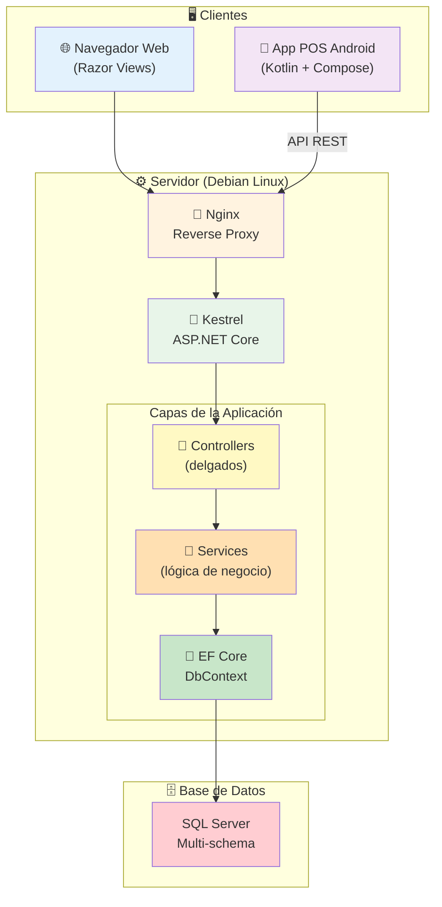

# Vercom ERP

> Sistema integral de gestión empresarial para S.U.R.L. cubana, conforme a normativas NCC/NCIF, ONAT y Resolución 60/2011 de la CGR.

[](https://dotnet.microsoft.com/)
[](https://www.microsoft.com/sql-server)
[](https://kotlinlang.org/)
[]()

---

## 📋 Tabla de Contenidos

- [Descripción](#-descripción)
- [Módulos](#-módulos)
- [Arquitectura](#-arquitectura)
- [Stack Tecnológico](#-stack-tecnológico)
- [Decisiones Técnicas Destacadas](#-decisiones-técnicas-destacadas)
- [Estructura del Repositorio](#-estructura-del-repositorio)
- [Requisitos](#-requisitos)
- [Instalación y Ejecución](#-instalación-y-ejecución)
- [App POS Android](#-app-pos-android)
- [Cumplimiento Normativo](#-cumplimiento-normativo)
- [Testing](#-testing)
- [Despliegue](#-despliegue)
- [Capturas de Pantalla](#-capturas-de-pantalla)
- [Autor](#-autor)

---

## 📖 Descripción

**Vercom ERP** es un sistema de planificación de recursos empresariales diseñado para una S.U.R.L. cubana con múltiples sucursales y centros de costo. Cubre el ciclo completo de operación: contabilidad, inventario, producción, recursos humanos, compras, ventas y gestión fiscal.

El sistema está compuesto por dos aplicaciones:

1. **Backend + Web (ASP.NET Core MVC)**: Interfaz administrativa completa.
2. **App POS Android (Kotlin + Jetpack Compose)**: Terminal de punto de venta con soporte **offline-first**.

### Objetivos principales

- ✅ Cumplir con la normativa contable y fiscal cubana (NCC, NCIF, ONAT, CGR).
- ✅ Garantizar trazabilidad e inmutabilidad de operaciones contables.
- ✅ Operar en entornos con conectividad inestable (POS offline-first).
- ✅ Soportar múltiples sucursales con aislamiento de datos por entidad.

---

## 🧩 Módulos

| Módulo | Estado | Descripción |
| :--- | :--- | :--- |
| **Núcleo y Seguridad** | ✅ Producción | Usuarios, roles, permisos granulares, auditoría inmutable |
| **Inventario** | ✅ Producción | Productos, familias, almacenes, movimientos, conteo físico |
| **Comercial (POS + Ventas)** | ✅ Producción | Facturación, clientes, proveedores, órdenes de compra |
| **Punto de Venta Android** | ✅ Producción | App nativa offline-first con sincronización |
| **Contabilidad** | 🔄 En desarrollo | Plan de cuentas MFP, asientos, estados financieros NCC |
| **RR.HH. y Nómina** | 🔄 En desarrollo | Expedientes, contratos, nómina, vacaciones, SC-4-08 |
| **Producción** | 🔄 En desarrollo | Órdenes, fichas de costo, BOM, mermas |
| **Reportes y ONAT** | 🔄 En desarrollo | Balance general, estado de resultados, DJ fiscales |

---

## 🏗️ Arquitectura



### Patrón arquitectónico

- **MVC** para la capa web (Razor Views).
- **Service Layer** para toda la lógica de negocio.
- **Repository + Unit of Work** (implícito vía `DbContext`).
- **MVVM + Clean Architecture** en la App POS Android.
- **Multi-Tenancy Row-Level** con **Global Query Filters** de EF Core.
- **Auditoría inmutable** vía `SaveChangesInterceptor` + triggers SQL.

---

## 🛠️ Stack Tecnológico

### Backend

| Categoría | Tecnología |
| :--- | :--- |
| **Framework** | ASP.NET Core MVC (.NET 10) |
| **Lenguaje** | C# 13 |
| **ORM** | Entity Framework Core 10 |
| **Autenticación** | ASP.NET Core Identity + JWT |
| **Hashing** | BCrypt.Net-Next |
| **Serialización** | System.Text.Json |
| **DI** | Microsoft.Extensions.DependencyInjection |

### Base de Datos

| Categoría | Tecnología |
| :--- | :--- |
| **Motor** | SQL Server 2022 |
| **Lenguaje** | T-SQL |
| **Técnicas** | Índices filtrados, computed columns, CHECK constraints, JSON validation, Query Store |
| **Migraciones** | EF Core Migrations |

### App POS (Android)

| Categoría | Tecnología |
| :--- | :--- |
| **Lenguaje** | Kotlin + Java |
| **UI** | Jetpack Compose + Material Design |
| **Arquitectura** | MVVM + Clean Architecture |
| **Persistencia** | Room (SQLite) + DataStore |
| **Red** | Retrofit + OkHttp |
| **DI** | Hilt |
| **Async** | Coroutines + Flow |
| **Sincronización** | WorkManager |
| **Escaneo** | CameraX + ML Kit |

### Frontend Web

Razor Views · Bootstrap 5 · jQuery · DataTables · Select2 · SweetAlert2 · Toastr · Chart.js · Tabler Icons

### DevOps

Linux (Debian 12) · Nginx · systemd · Kestrel · Bash · Git · Gradle

---

## ⭐ Decisiones Técnicas Destacadas

### 1. Multi-Tenancy Row-Level con Global Query Filters

Se implementó aislamiento de datos por entidad **sin repetir código en cada consulta**, usando expresiones LINQ dinámicas en `OnModelCreating`:

```csharp
foreach (var entityType in modelBuilder.Model.GetEntityTypes())
{
    var entidadIdProp = entityType.FindProperty("EntidadId");
    if (entidadIdProp != null)
    {
        var parameter = Expression.Parameter(entityType.ClrType, "e");
        var filter = Expression.Equal(
            Expression.Property(parameter, "EntidadId"),
            Expression.Property(Expression.Constant(this), nameof(CurrentEntidadId)));
        
        modelBuilder.Entity(entityType.ClrType)
            .HasQueryFilter(Expression.Lambda(filter, parameter));
    }
}
```

**Beneficio:** Cada consulta queda automáticamente filtrada por la entidad del usuario, imposibilitando fugas de datos entre tenants.

---

### 2. Auditoría Inmutable a Dos Niveles

Se implementó auditoría combinando **EF Core** y **triggers SQL Server** para garantizar trazabilidad completa:

**Nivel 1 — Interceptor de EF Core:**

```csharp
public class AuditInterceptor : SaveChangesInterceptor
{
    public override ValueTask<InterceptionResult<int>> SavingChangesAsync(
        DbContextEventData eventData, InterceptionResult<int> result, ...)
    {
        // Captura INSERT, UPDATE, DELETE con valores anteriores y nuevos
        // Almacena JSON con usuario, IP, canal (ERP/API/POS)
    }
}
```

**Nivel 2 — Trigger SQL Server:**

```sql
INSERT INTO nucleo.auditoria (usuario_id, accion, esquema_tabla, valores_nuevos, canal)
SELECT 
    TRY_CAST(SESSION_CONTEXT(N'current_user_id') AS UNIQUEIDENTIFIER),
    'INSERT',
    'comercial.cliente',
    (SELECT i.* FOR JSON PATH, WITHOUT_ARRAY_WRAPPER),
    ISNULL(TRY_CAST(SESSION_CONTEXT(N'current_channel') AS NVARCHAR(20)), 'ERP')
FROM inserted i;
```

**Beneficio:** Cumple con la **Resolución 60/2011 de la CGR** — trazabilidad de quién, qué, cuándo y desde dónde.

---

### 3. Numeración Consecutiva Garantizada (RNF-51)

Para evitar duplicados o saltos en numeración de facturas y comprobantes:

```csharp
var sql = @"
    UPDATE nucleo.consecutivo WITH (UPDLOCK, ROWLOCK)
    SET ultimo_numero = ultimo_numero + 1
    OUTPUT INSERTED.ultimo_numero
    WHERE entidad_id = @p0 AND tipo_documento = @p1 AND serie = @p2";
```

**Beneficio:** Concurrencia segura entre ERP y POS simultáneos, sin necesidad de bloqueos a nivel de aplicación.

---

### 4. POS Android Offline-First

La App POS sigue operando sin conexión y sincroniza al reconectar, usando:

- **Room/SQLite** para persistencia local.
- **Idempotency Keys** para evitar duplicados al subir ventas.
- **WorkManager** para cola de sincronización resiliente.
- **Rangos de numeración asignados por bloques** desde el servidor.

**Beneficio:** Operación continua ante cortes de red o eléctricos.

---

### 5. Cumplimiento de Nomenclador Contable Cubano

El plan de cuentas sigue la **Resolución 494/2016 del MFP**, con soporte para:

- Cuentas jerárquicas (código, padre, nivel).
- Subcuentas obligatorias por tipo de tercero.
- Inmutabilidad de asientos contabilizados (solo reversión vía ajuste).

---

## 📁 Estructura del Repositorio

```
Vercom-ERP/
├── src/
│   ├── Vercom.Web/              # ASP.NET Core MVC
│   │   ├── Controllers/
│   │   ├── Views/
│   │   ├── wwwroot/
│   │   └── Program.cs
│   ├── Vercom.Services/         # Lógica de negocio
│   ├── Vercom.Data/             # EF Core DbContext + Entidades
│   └── Vercom.Shared/           # DTOs, ViewModels, Utilidades
├── android/
│   └── VercomPos/               # App POS Android (Kotlin)
├── database/
│   ├── scripts/                 # Scripts SQL
│   └── seed/                    # Datos iniciales
├── docs/
│   ├── architecture.md
│   └── screenshots/
└── README.md
```

---

## ✅ Requisitos

- **.NET SDK 10.0**
- **SQL Server 2022** (o superior)
- **Android Studio** (para la App POS)
- **Git**

---

## 🚀 Instalación y Ejecución

### 1. Clonar el repositorio

```bash
git clone https://github.com/YordGNU/Vercom-ERP.git
cd Vercom-ERP
```

### 2. Configurar la base de datos

```bash
sqlcmd -S localhost -U sa -P 'tu_password' -i database/scripts/schema.sql
sqlcmd -S localhost -U sa -P 'tu_password' -i database/seed/initial_data.sql
```

### 3. Configurar la conexión

Edita `src/Vercom.Web/appsettings.Development.json`:

```json
{
  "ConnectionStrings": {
    "DefaultConnection": "Server=localhost;Database=VercomERP;UID=sa;Password=tu_password;TrustServerCertificate=True"
  },
  "Jwt": {
    "SecretKey": "tu_clave_de_al_menos_32_caracteres_aqui"
  }
}
```

### 4. Ejecutar la aplicación

```bash
cd src/Vercom.Web
dotnet restore
dotnet run
```

La aplicación estará disponible en `https://localhost:5001`.

---

## 📱 App POS Android

### Requisitos

- Android Studio (versión reciente)
- SDK Android mínimo: API 26 (Android 8.0)
- Kotlin

### Compilar y ejecutar

```bash
cd android/VercomPos
./gradlew assembleDebug
```

El APK se generará en `app/build/outputs/apk/debug/`.

### Características offline-first

- ✅ Operación completa sin conexión
- ✅ Sincronización automática al reconectar
- ✅ Cola de ventas pendientes con reintentos
- ✅ Idempotencia garantizada por `idempotency_key`

---

## 📜 Cumplimiento Normativo

| Normativa | Aplicación |
| :--- | :--- |
| **NCC / NCIF** | Plan de cuentas, asientos, estados financieros |
| **Resolución 494/2016 MFP** | Nomenclador de cuentas |
| **Ley 113 (ONAT)** | Impuestos, DJ, retenciones |
| **Resolución 60/2011 CGR** | Auditoría, separación de funciones, trazabilidad |
| **Código de Trabajo (Ley 116/2013)** | Nómina, vacaciones, subsidios |

---

## 🧪 Testing

El proyecto usa:

- **xUnit** para tests unitarios
- **Moq** para mocking
- **FluentAssertions** para aserciones legibles

Ejecutar tests:

```bash
dotnet test
```

Cobertura en lógica crítica: **>85%** (contabilidad, nómina, seguridad).

---

## 🚢 Despliegue

El sistema está desplegado en **Debian 12** con:

- **Nginx** como reverse proxy
- **systemd** para gestión del servicio
- **Kestrel** como servidor de aplicaciones
- **SQL Server 2022** on-premise

### Script de despliegue

```bash
# Publicar
dotnet publish -c Release -o /var/www/vercom

# Reiniciar servicio
sudo systemctl restart vercom

# Verificar logs
sudo journalctl -u vercom.service -f
```

---

## 📸 Capturas de Pantalla

### Dashboard principal


### Módulo de inventario


### App POS Android


### Auditoría inmutable


---

## 📄 Licencia

Este proyecto es de uso privado. Todos los derechos reservados.

---

## 👤 Autor

**Yordani Velázquez Cruz**

- 📧 yordanisvc@gmail.com
- 🔗 [LinkedIn](https://linkedin.com/in/yordgnu83220388)
- 🐙 [GitHub](https://github.com/YordGNU)

---

*Última actualización: Octubre 2026*
